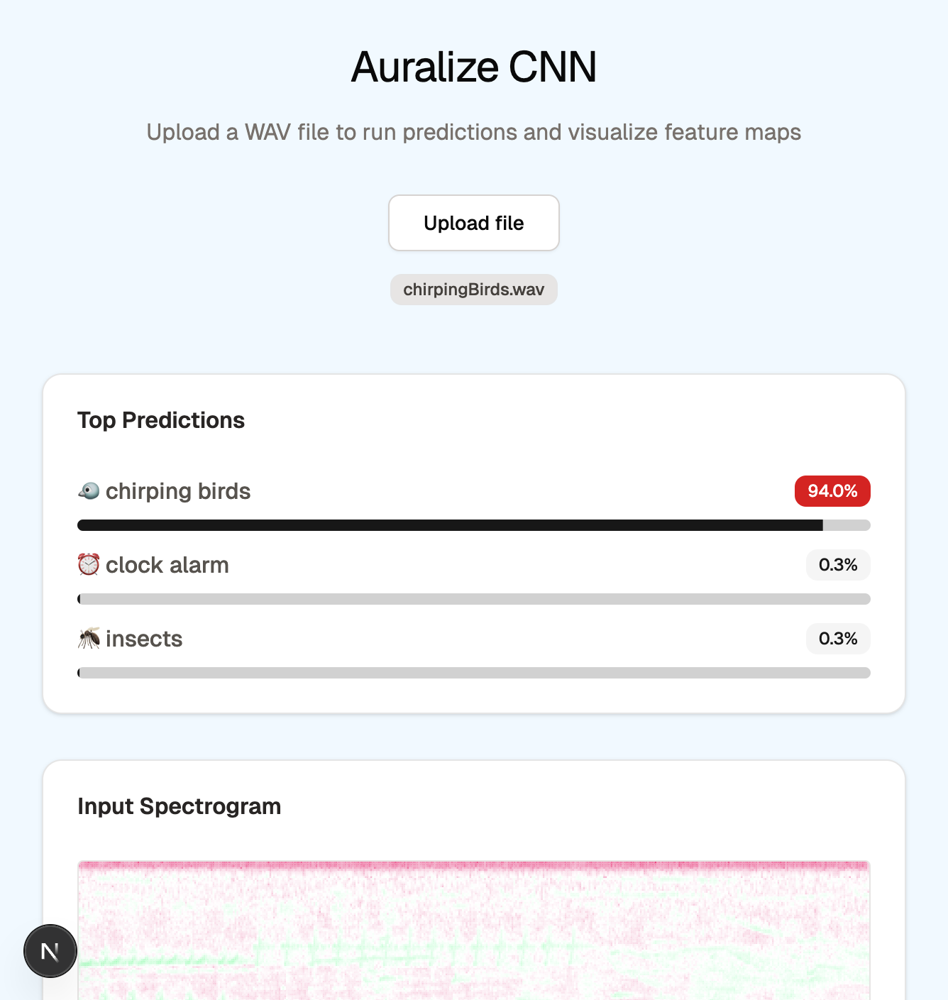
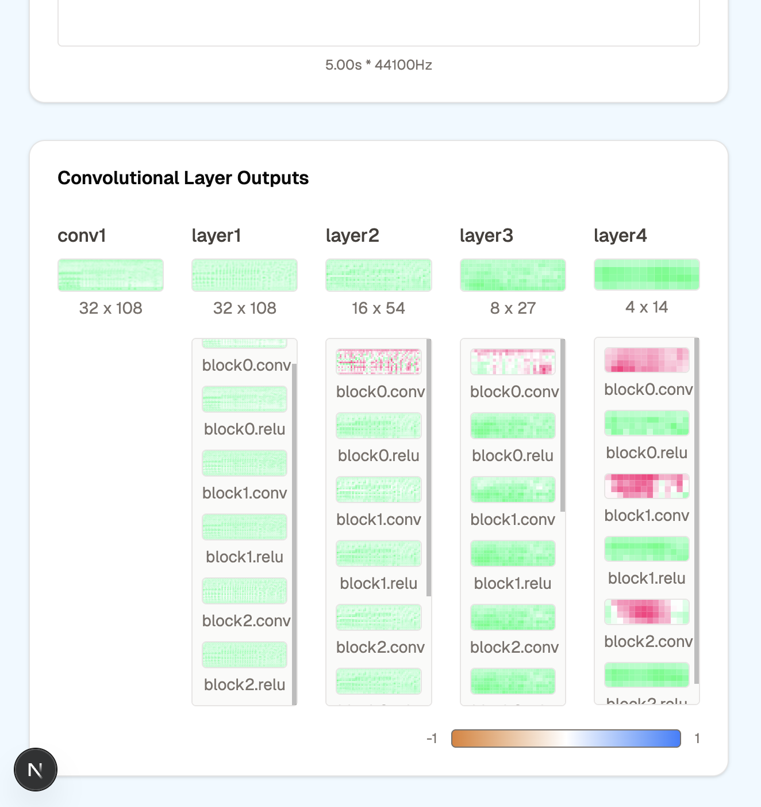
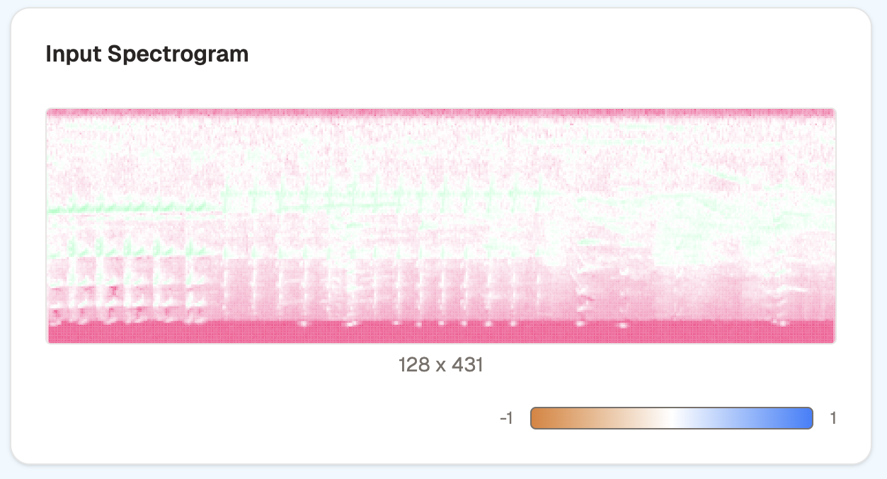

# 🚀 Auralize CNN

Auralize CNN lets you upload a WAV audio file and visualize how a trained convolutional neural network (CNN) processes the audio. It displays model predictions alongside detailed visualizations of the input spectrogram, waveform, and internal feature maps, helping you explore how the model interprets sound data.

## Tech Stack

**Client:** Next.js, Tailwind CSS, TypeScript, Shadcn

## Screenshots







## 📦 Environment Variables (`.env`)

```env

# Modal (API KEY)

NEXT_PUBLIC_MODAL_API=

```
